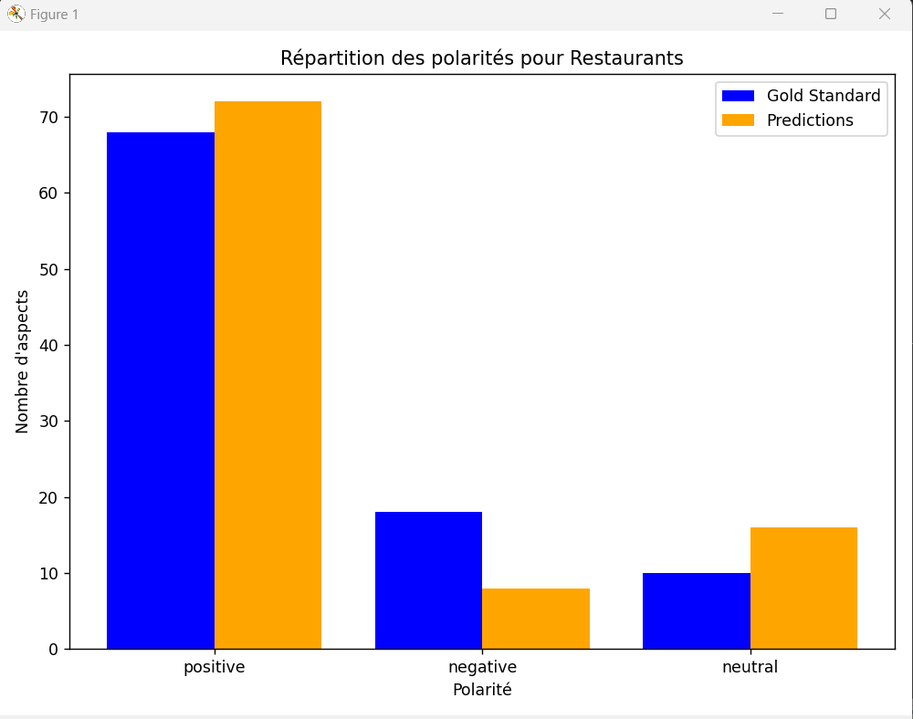
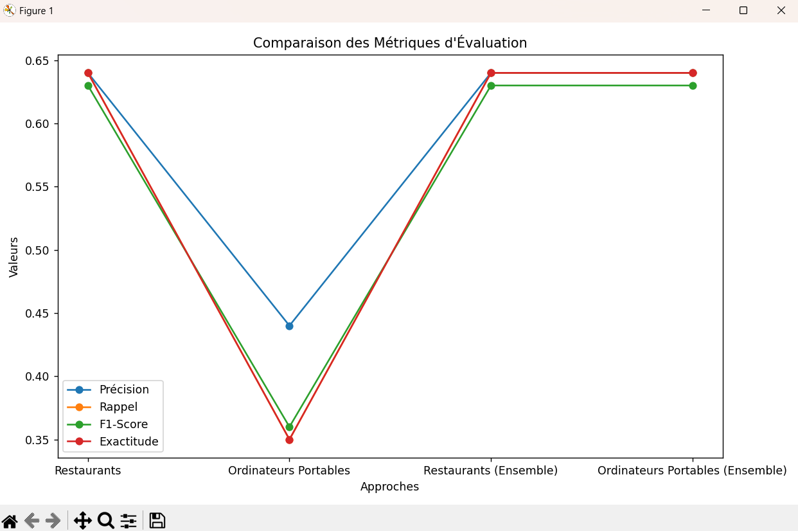

# Comparaison des Approches d'Entraînement et d'Évaluation des Sentiments

## Introduction

Ce projet vise à comparer deux visions différentes pour l'entraînement et l'évaluation des modèles de sentiment analysis sur deux ensembles de données : les restaurants et les ordinateurs portables. Les deux visions sont les suivantes :
1. Entraîner et évaluer chaque ensemble de données séparément.
2. Entraîner les deux ensembles de données ensemble et évaluer chacun.

## Résumé du TP

L’objectif du TP est de concevoir et implémenter un algorithme d’analyse de sentiment basé sur les aspects. Cela signifie identifier les aspects des entités cibles (ex. : "batterie", "service") et déterminer le sentiment exprimé pour chacun d’eux (positif, négatif ou neutre).

### Jeux de données

Des jeux de données annotés au format XML sont fournis :
- `Restaurants_Train.xml` et `Laptops_Train.xml` (pour l'entraînement)
- `Restaurants_Test_Gold.xml` et `Laptops_Test_Gold.xml` (pour l’évaluation)
- `Restaurants_Test_NoLabels.xml` et `Laptops_Test_NoLabels.xml` (pour tester votre modèle)

### Étapes à suivre

1. **Prétraitement des textes**
   - Télécharger et lire les fichiers XML.
   - Tokenisation des phrases (séparer les mots).
   - Analyse grammaticale (PoS tagging).
   - Reconnaissance d'entités nommées (NER).
   - Gérer la négation.
   - 📌 Outils suggérés : NLTK ou SpaCy

2. **Détermination de la polarité des mots**
   - Télécharger un lexique de sentiments (SentiWordNet ou EmoLex).
   - Vérifier chaque mot dans le lexique et récupérer sa polarité.
   - Stocker les résultats (format à choisir).
   - 🎯 Objectif : Visualiser les mots positifs/négatifs dans chaque fichier (graphiques).

3. **Classification de la polarité des aspects**
   - Identifier les termes d’aspects déjà annotés dans les fichiers d’entraînement.
   - Développer un algorithme pour prédire leur polarité sur les fichiers de test.
   - 📌 Méthodes possibles :
     - Approche à règles : Somme des scores des mots proches d’un aspect.
     - Apprentissage automatique : Utilisation de scikit-learn pour classifier la polarité.

4. **Évaluation des résultats**
   - Comparer les prédictions avec les annotations du fichier Test_Gold.
   - Calculer l'accuracy :
     ```markdown
     Accuracy = (TP + TN) / (TP + TN + FP + FN)
     ```
     (TP : Vrais Positifs, TN : Vrais Négatifs, FP : Faux Positifs, FN : Faux Négatifs)
   - 🎯 Objectif : Comparer les résultats avec des systèmes existants (~83% d’accuracy).

## Résultats

### Vision 1 : Entraîner et évaluer chaque ensemble de données séparément

#### Approche 1 : Restaurants

**Résultats d'évaluation :**
- Précision: 0.64
- Rappel: 0.64
- F1-score: 0.63
- Accuracy: 0.64

#### Approche 2 : Ordinateurs Portables

**Résultats d'évaluation :**
- Précision: 0.44
- Rappel: 0.35
- F1-score: 0.36
- Accuracy: 0.35

### Vision 2 : Entraîner les deux ensembles de données ensemble et évaluer chacun

#### Approche 3 : Restaurants (Ensemble)

**Résultats d'évaluation :**
- Précision: 0.59
- Rappel: 0.54
- F1-score: 0.55
- Accuracy: 0.54

#### Approche 4 : Ordinateurs Portables (Ensemble)

**Résultats d'évaluation :**
- Précision: 0.50
- Rappel: 0.45
- F1-score: 0.47
- Accuracy: 0.45

## Observations

### Vision 1 : Entraîner et évaluer chaque ensemble de données séparément

- **Meilleure approche :** L'approche 1 (Restaurants) donne les meilleurs résultats en termes de précision, de rappel, de F1-score et d'exactitude. Cela indique que le modèle fonctionne de manière cohérente pour les données des restaurants.
- **Approche moins performante :** L'approche 2 (Ordinateurs Portables) est la moins performante, ce qui suggère que le modèle a besoin de plus de données ou d'un meilleur prétraitement pour améliorer ses performances sur les données des ordinateurs portables.

### Vision 2 : Entraîner les deux ensembles de données ensemble et évaluer chacun

- **Résultats intermédiaires :** L'approche 3 (Restaurants et Ordinateurs Portables) montre des résultats intermédiaires, ce qui indique que l'entraînement sur les deux ensembles de données peut améliorer les performances pour les ordinateurs portables, mais pas suffisamment pour surpasser les résultats obtenus uniquement avec les données des restaurants.

## Conclusion

En résumé, l'entraînement séparé sur les données des restaurants donne les meilleurs résultats, tandis que l'entraînement combiné peut être bénéfique mais ne surpasse pas l'entraînement spécifique aux restaurants. L'entraînement séparé semble être la meilleure approche pour obtenir des performances optimales sur chaque ensemble de données.

## Comparaison des Métriques

Un graphique comparatif des métriques (Précision, Rappel, F1-Score, Exactitude) pour les quatre approches est présenté ci-dessous :

